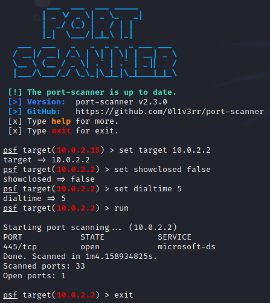

# Port Scanner
This is a terminal application that allows you to find opened ports on your network.<br>
Inspired by [Nmap](https://github.com/nmap/nmap) and [Metasploit](https://github.com/rapid7/metasploit-framework).



## Setup
First, you need to download [Go](https://golang.org/dl/) and [Git](https://git-scm.com/downloads)<br>
*Note: Some features of the program use Git. Make sure you have it installed.*<br>
Then clone this repository:
```sh
git clone https://github.com/0l1v3rr/port-scanner.git
cd port-scanner
```
On Linux or Mac, use the `make run` command, to run the app.<br>
On Windows *(It only works on Git Bash!)*: `go run cmd/port-scanner/main.go`

## Install on Termux
```sh
$ pkg update -y && pkg upgrade -y
$ pkg install git
$ pkg install golang
$ pkg install make
$ git clone https://github.com/0l1v3rr/port-scanner.git
$ cd port-scanner
$ make run
```

## Use anywhere as a command
For example on Linux, open a terminal and type this command:
```sh
nano ~/.profile
```
Now scroll to the bottom and paste this:
```sh
export PATH="$PATH:/usr/local/port-scanner/bin"
```
*This is just an example, you should use your own path.*